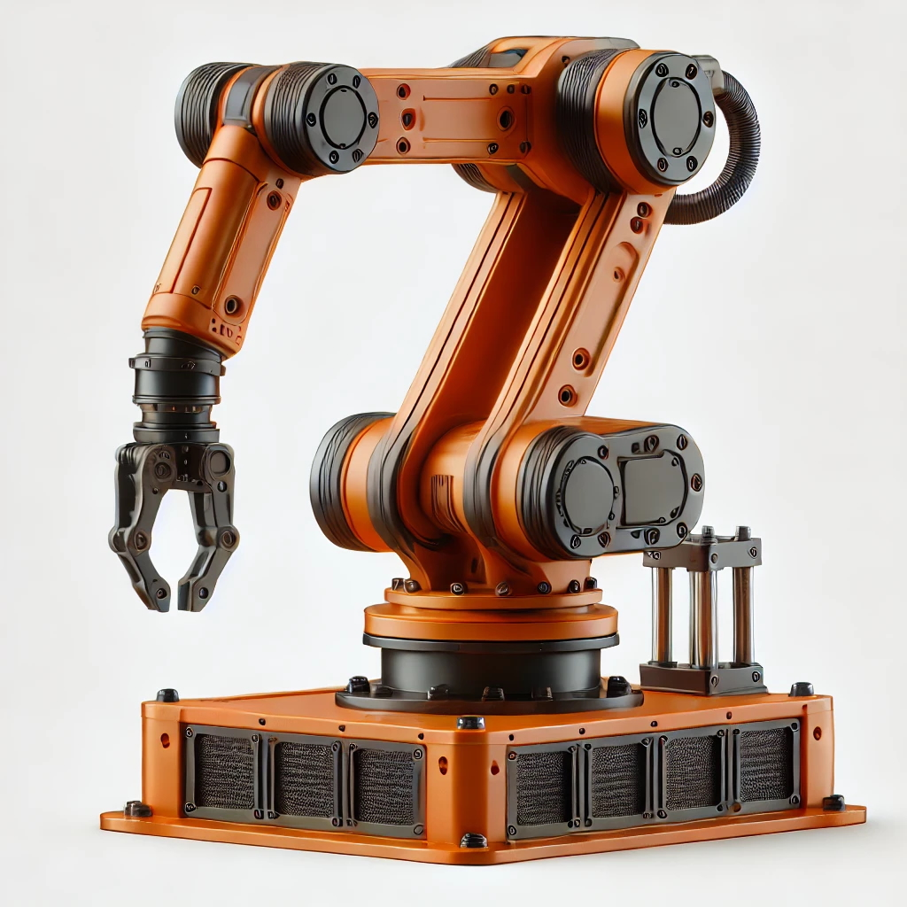

# Robotika

<figure style="margin: 0; padding: 0; text-align: center;">
    
</figure>

    <h1 style="font-size: 3em; margin-bottom: 20px;">Robotika</h1>
    <h2 style="font-size: 2em; margin-bottom: 40px;">Autori</h2>
    
doc. dr. sc. Nikola Anđelić

    
Sandi Baressi Šegota

    
doc. dr. sc. Ivan Lorencin

    
&copy; 2025 - Sveučilište Jurja Dobrile u Puli, Fakultet informatike

Ova knjižica sadrži pregled osnova robotike i detalje o specijaliziranim temama. Svaka tema razrađena je u zasebnoj datoteci:

1. [Uvod u Robotiku](./uvod_u_robotiku.md)
2. [Konstrukcijski elementi robota](./konstrukcijski_elementi_robota.md)
3. [Planiranje Trajektorije](./planiranje_trajektorije.md)
4. [Dinamika Robota](./dinamika_robota.md)
5. [Programiranje Robotskih Manipulatora](./programiranje_manipulatora.md)
6. [Distributivna Inteligencija i Više-Robotski Sustavi](./distribuitivna_inteligencija.md)
7. [Teorija Mapiranja i Istraživanja](./mapiranje_i_istrazivanje.md)
8. [Više-Robotska Arhitektura](./viserobotska_arhitektura.md)
9. [Senzori: Podjela i Primjena](./senzori.md)
10. [Algoritmi Planiranja Putanje uz Izbjegavanje Prepreka](./algoritmi_izbjegavanja_prepreka.md)
11. [Upravljanje Formacijama](./upravljanje_formacijama.md)
12. [Podržano Učenje (Reinforcement Learning)](./podrzano_ucenje.md)
13. [Zaključak](./zakljucak.md)
