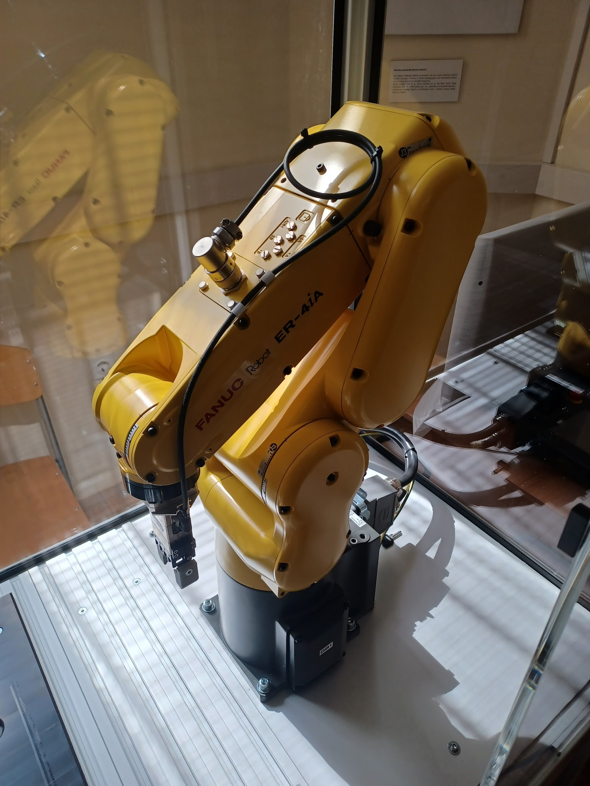
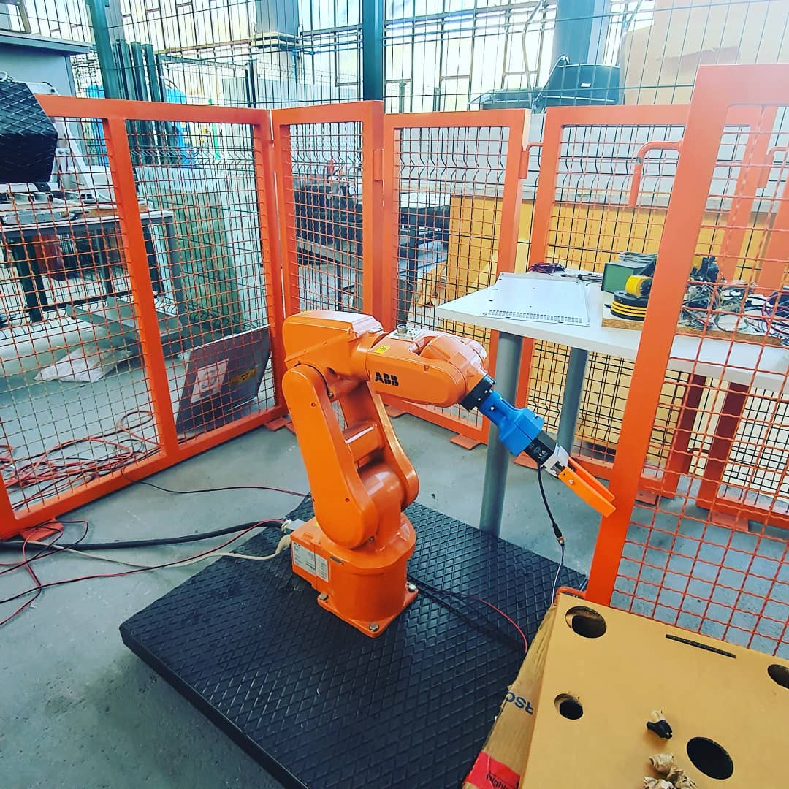
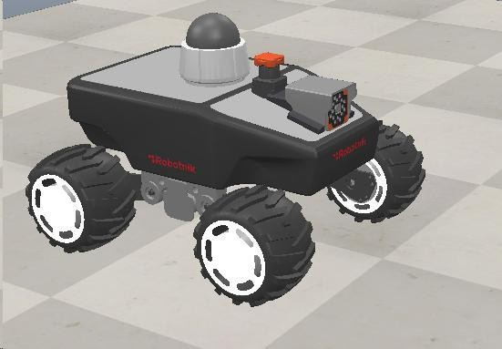
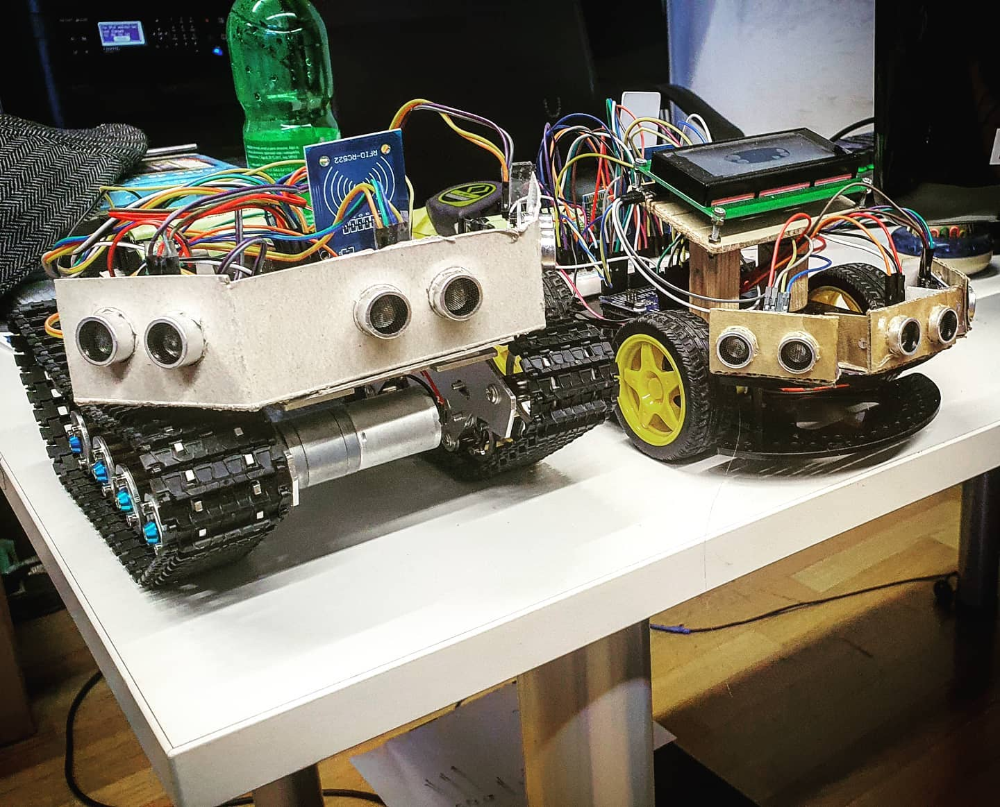
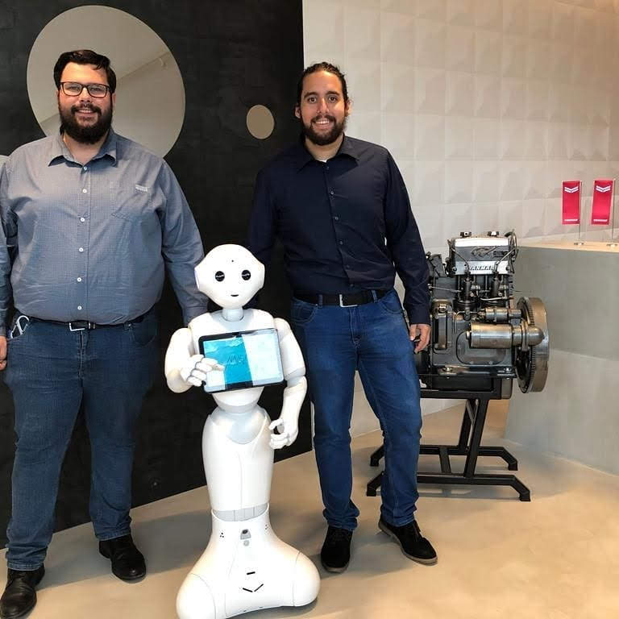
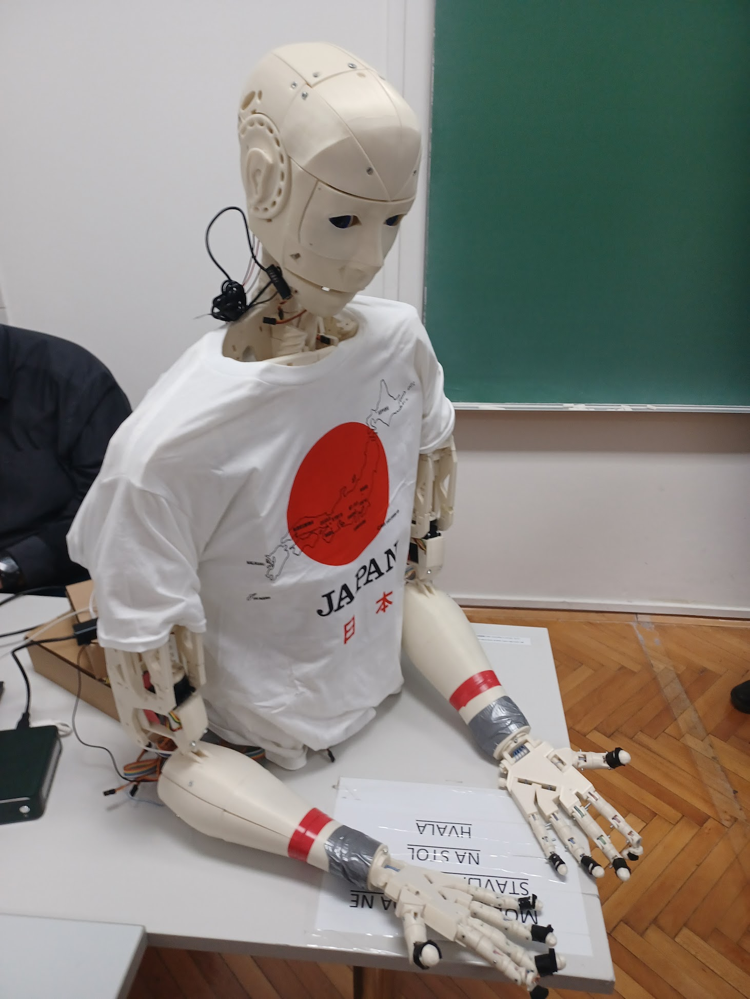

# Uvod u Robotiku

Robotika je interdisciplinarno područje koje se bavi razvojem, projektiranjem i primjenom robota. Roboti su elektro-mehaničke naprave koje koriste senzore, aktuatore i računalne algoritme kako bi obavljali različite zadatke. Osnovna svrha robotike je automatizacija repetitivnih, opasnih ili preciznih zadataka, čime se povećava učinkovitost i sigurnost u raznim područjima primjene.

---

## Povijest Robotike

Povijest robotike proteže se tisućama godina unatrag. Još u antici, grčki filozofi i izumitelji razvijali su prve mehaničke naprave. Arhita iz Tarenta, primjerice, stvorio je mehaničku pticu pokretanu parom. U renesansi, Leonardo da Vinci dizajnirao je humanoidnog viteza koji je mogao podizati ruke i pomicati glavu, čime je postavio temelje za razvoj humanoidnih robota.

Modernu robotiku obilježavaju ključne prekretnice poput uvođenja prvog industrijskog robota "Unimate" 1961. godine. Taj robot bio je korišten u automobilskoj industriji za manipulaciju teškim dijelovima, čime je otvorio vrata automatizaciji u proizvodnim procesima. Danas, robotika obuhvaća širok raspon primjena, od medicinskih robota koji pomažu u kirurškim zahvatima do autonomnih vozila koja revolucioniraju transport.

---

## Osnovne Komponente Robota

Robot se sastoji od nekoliko osnovnih komponenata koje mu omogućuju obavljanje složenih zadataka. Mehanička struktura čini osnovu robota i uključuje dijelove poput manipulatora i krajnjih djelovatelja. Manipulator je dio robota koji se sastoji od zglobova i segmenata, omogućujući mu da se kreće i manipulira objektima.

Senzori omogućuju robotu da percipira svoju okolinu. Na primjer, kamere pružaju vizualne informacije, dok ultrazvučni senzori mjere udaljenost do prepreka. Aktuatori, poput električnih motora, omogućuju fizičko gibanje robota. Konačno, kontrolni sustavi koordiniraju rad senzora i aktuatora, osiguravajući da robot precizno izvršava zadane zadatke.

---

## Različite Vrste Robota

### Industrijski roboti
Industrijski roboti koriste se u proizvodnim pogonima za montažu, zavarivanje i rukovanje materijalima. Ovi roboti obično imaju visok stupanj točnosti i ponovljivosti, što ih čini idealnima za zahtjevne industrijske procese.

*Slika: Industrijski manipulator Fanuc.*

*Slika: Industrijski manipulator ABB irb 120.*

### Mobilni roboti
Mobilni roboti, poput robotskih usisavača i autonomnih vozila, dizajnirani su za kretanje u okruženju. Oni koriste kombinaciju senzora i algoritama za navigaciju kroz dinamične i nepredvidive uvjete.

*Slika: Simulacija mobilnog robota.*

*Slika: Prototip autonomnog vozila i mobilnog robota gusjeničara.*

### Humanoidni roboti
Humanoidni roboti, poput Pepper, oponašaju ljudsku anatomiju i pokrete, često se koristeći za društvene interakcije i istraživanje.

*Slika: Humanoidni robot Pepper, primjer naprednog dizajna u robotici.*

*Slika: Humanoidni robot Timmyja Hartera, prototip humanoidnog robota izrađen od strane Hartera Robotics iz Matulja.*

### Medicinski roboti
Medicinski roboti imaju specijalizirane funkcije, uključujući asistenciju pri operacijama i rehabilitaciju pacijenata. Na primjer, Da Vinci sustav omogućuje kirurzima izvođenje minimalno invazivnih zahvata uz visoku preciznost.
