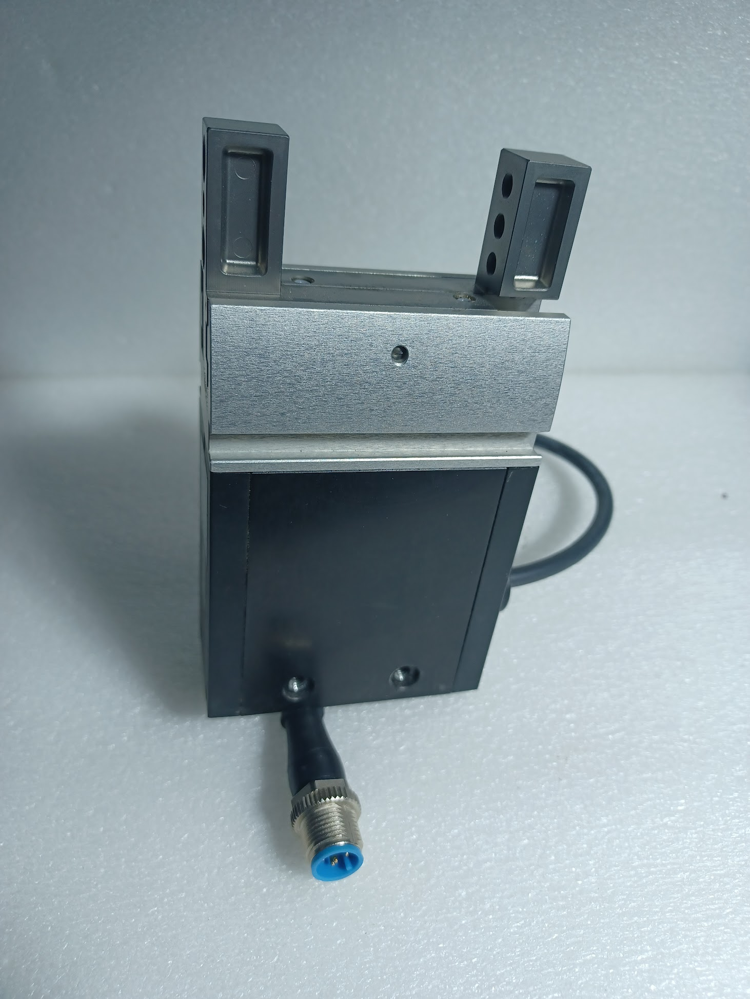
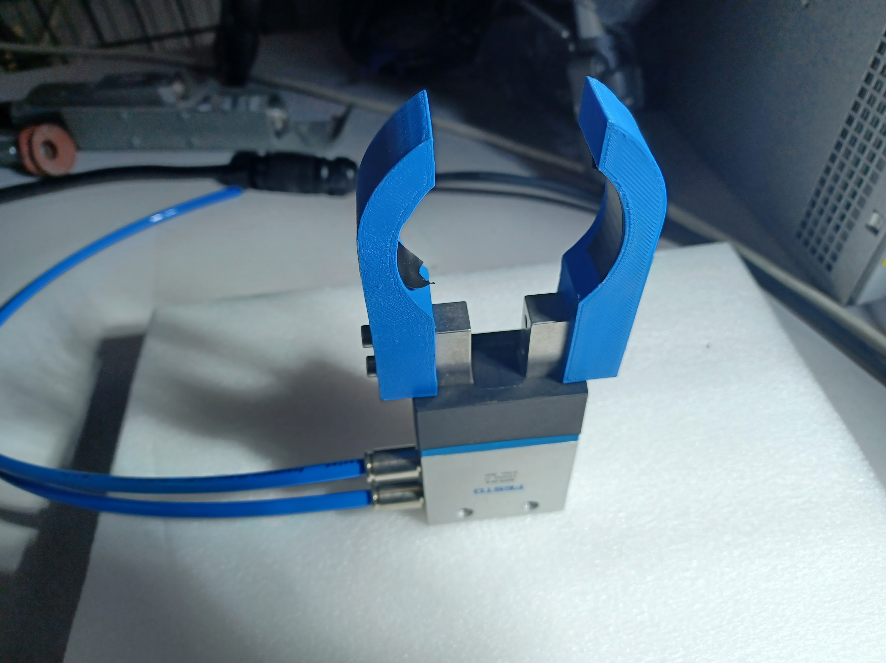
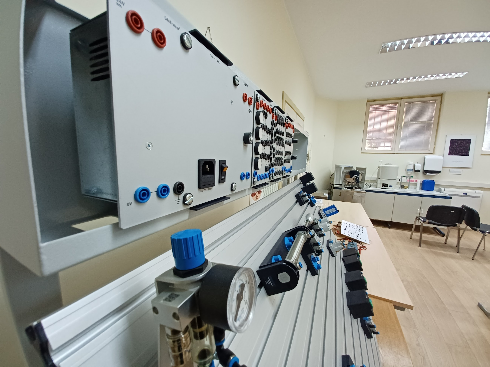
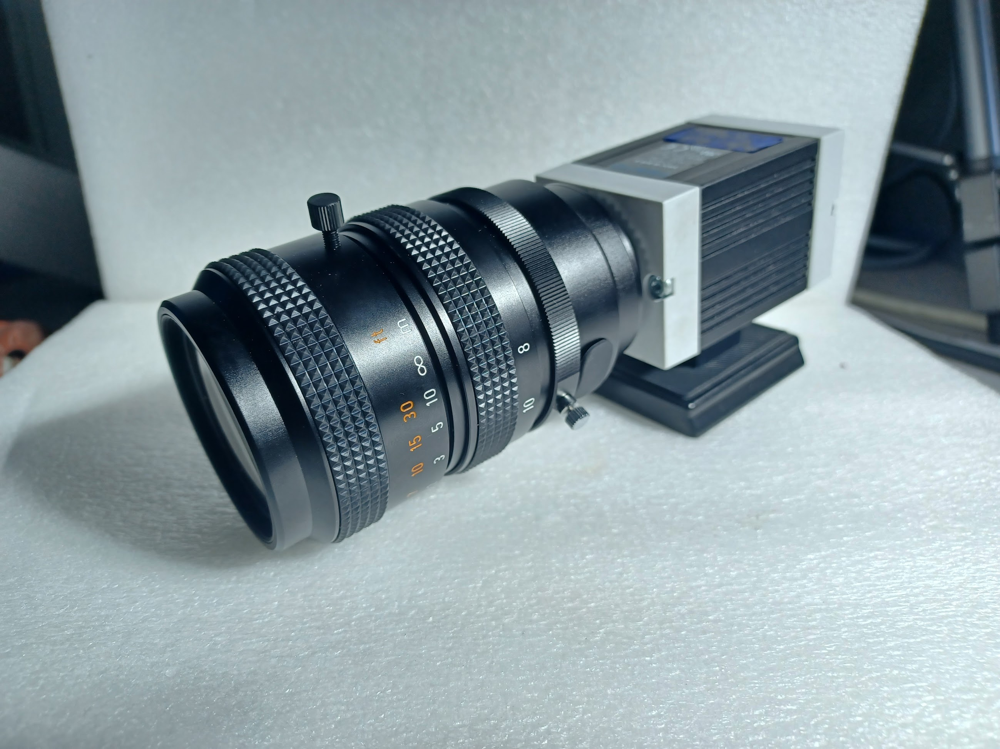
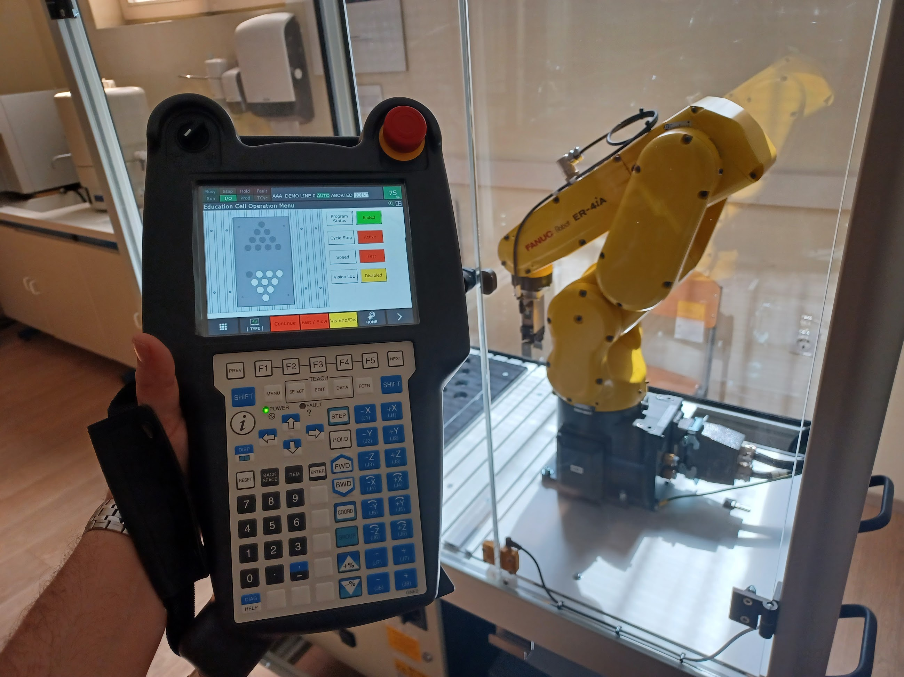
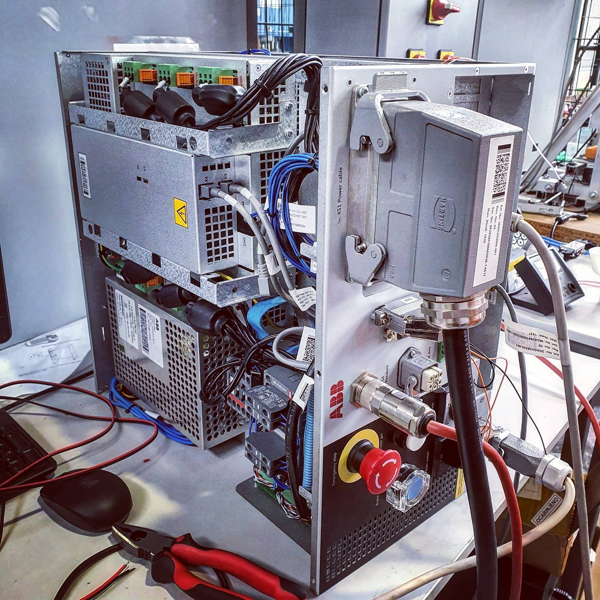

# Uvod u Robotiku

Robotika je interdisciplinarno područje koje se bavi razvojem, projektiranjem i primjenom robota. Roboti su elektro-mehaničke naprave koje koriste senzore, aktuatore i računalne algoritme kako bi obavljali različite zadatke. Osnovna svrha robotike je automatizacija repetitivnih, opasnih ili preciznih zadataka, čime se povećava učinkovitost i sigurnost u raznim područjima primjene.

## Povijest Robotike

Robotika ima bogatu povijest koja seže tisućama godina unatrag. Neki ključni trenutci uključuju:
- **350. pr. Kr.:** Arhita iz Tarenta stvorio je mehaničku pticu pokretanu parom.
- **1495.:** Leonardo da Vinci dizajnirao je humanoidnog viteza koji je mogao pomicati ruke i glavu.
- **1921.:** Karel Čapek prvi je put upotrijebio riječ "robot" u drami *R.U.R.* (Rossumovi Univerzalni Roboti).
- **1961.:** "Unimate," prvi industrijski robot, uveden je u automobilskoj industriji.
- **Danas:** Roboti su integrirani u svakodnevni život, uključujući medicinu, istraživanje svemira i pametne kućanske uređaje.

Modernu robotiku obilježavaju ključne prekretnice poput uvođenja prvog industrijskog robota "Unimate" 1961. godine. Taj robot bio je korišten u automobilskoj industriji za manipulaciju teškim dijelovima, čime je otvorio vrata automatizaciji u proizvodnim procesima. Danas, robotika obuhvaća širok raspon primjena, od medicinskih robota koji pomažu u kirurškim zahvatima do autonomnih vozila koja revolucioniraju transport.

## Osnovne Komponente Robota

Robot se sastoji od nekoliko osnovnih komponenata koje mu omogućuju obavljanje složenih zadataka, a one su: 

1. **Mehanička struktura:** Skelet robota koji uključuje zglobove, krajnje djelovatelje i baze.
2. **Senzori:** Omogućuju robotu percepciju okoline, kao što su kamere, ultrazvučni senzori i enkoderi.
3. **Aktuatori:** Pokreću dijelove robota, uključujući motore i hidrauličke sustave.
4. **Kontrolni sustavi:** Elektroničke i računalne komponente koje upravljaju ponašanjem robota.

Mehanička struktura čini osnovu robota i uključuje dijelove poput manipulatora i krajnjih djelovatelja. Manipulator je dio robota koji se sastoji od zglobova i segmenata, omogućujući mu da se kreće i manipulira objektima.

Senzori omogućuju robotu da percipira svoju okolinu. Na primjer, kamere pružaju vizualne informacije, dok ultrazvučni senzori mjere udaljenost do prepreka. Aktuatori, poput električnih motora, omogućuju fizičko gibanje robota. Konačno, kontrolni sustavi koordiniraju rad senzora i aktuatora, osiguravajući da robot precizno izvršava zadane zadatke.

## Definicije i Stručni Izrazi u Robotici

- **Robot:** Elektromehanička naprava sposobna za interakciju sa svojom okolinom i izvršavanje zadataka prema unaprijed definiranom programu.
- **Manipulator:** Dio robota koji omogućuje precizne pokrete i manipulaciju objektima. Primjeri uključuju robotske ruke u industriji.
- **Krajnji djelovatelj (End-effector):** Specijalizirani alat na kraju manipulatora, poput hvataljki, alata za zavarivanje ili kamera.
- **Senzori:** Uređaji za percepciju okoline. Primjeri uključuju kamere, LIDAR i ultrazvučne senzore.
- **Aktuatori:** Motori i sustavi koji pokreću dijelove robota, omogućujući gibanje i interakciju.
- **Radni prostor:** Prostor unutar kojeg se krajnji djelovatelj robota može kretati.
- **Točnost:** Mjera preciznosti u dosezanju zadanog cilja.
- **Ponovljivost:** Sposobnost robota da više puta postigne isti položaj s jednakim odstupanjem.

# Industrijski Roboti

Industrijski roboti su autonomni ili poluautonomni strojevi dizajnirani za obavljanje repetitivnih, preciznih i često fizički zahtjevnih zadataka u industrijskim okruženjima. Oni su ključni dio modernih proizvodnih procesa, omogućujući visoku produktivnost, dosljednu kvalitetu i sigurnost. Ovi roboti rade u kontroliranim uvjetima gdje mogu izvoditi zadatke s minimalnim utjecajem ljudskih faktora.

*Slika: Industrijski robot ABB irb 120.*

## Glavne Karakteristike Industrijskih Robota

1. **Točnost:** Sposobnost izvođenja zadataka s vrlo malim odstupanjima od zadanih parametara (često u mikrometrima).
2. **Ponovljivost:** Roboti mogu višekratno izvoditi iste zadatke s istim rezultatom.
3. **Brzina:** Omogućuje brzo izvođenje zadataka, čime se povećava ukupna učinkovitost proizvodnih procesa.
4. **Fleksibilnost:** Moderni industrijski roboti mogu se programirati za različite zadatke, što omogućuje brzu prilagodbu promjenama u proizvodnji.
5. **Nosivost:** Ovisno o primjeni, industrijski roboti mogu rukovati teretima od nekoliko grama do nekoliko tona.

---

## Komponente Industrijskog Robota

1. **Manipulator (Robotska Ruka):**
   Manipulator ima više stupnjeva slobode, omogućujući kretanje u različitim smjerovima. Sastoji se od segmenata povezanih zglobovima koji omogućuju rotaciju i translaciju.

*Slika: Industrijski manipulator Fanuc.*

2. **Krajnji Djelovatelj (End-Effector):**
   Specifičan alat na kraju manipulatora prilagođen za određeni zadatak, poput hvataljke, zavarivača, bušilice ili kamere.

   
*Slika: Električna hvataljka.*

   
*Slika: Pneumatska hvataljka.*

3. **Sustav Pogona:**
   Pogoni mogu biti električni, hidraulički ili pneumatski, ovisno o zahtjevima zadatka. Električni pogoni često se koriste zbog svoje preciznosti i energetske učinkovitosti.

   
*Slika: Pogon pneumatskog cilindra.*

4. **Senzori:**
   Omogućuju robotu da "osjeća" okolinu, uključujući vizualne senzore, senzore dodira i senzore sile.

   
*Slika: Industrijska kamera.*

5. **Kontrolni Sustav:**
   "Mozak" robota koji interpretira programe i upravlja kretanjem manipulatora i rada senzora.

*Slika: Teach pendant industrijskog robota.*

*Slika: Upravljačka jedinica industrijskog robota.*

## Vrste Industrijskih Robota

### Kartezijskih Robota (XYZ Roboti)
- Imaju tri linearne osi koje omogućuju gibanje u pravcu X, Y i Z.
- Često se koriste za zadatke poput rukovanja materijalima i montaže.
- **Prednost:** Jednostavna konstrukcija i velika nosivost.

### Cilindrični Roboti
- Kreću se u cilindričnom prostoru koristeći linearne i rotacijske osi.
- Koriste se za zadatke poput točkastog zavarivanja i premještanja predmeta.

### Sferni Roboti
- Imaju sferni radni prostor i koriste rotacijske i linearne osi.
- Pogodni su za zadatke poput bojanja i inspekcije.

### SCARA Roboti (Selective Compliance Assembly Robot Arm)
- Specijalizirani za brzu i preciznu montažu i premještanje malih objekata.
- Koriste se u elektroničkoj industriji za sastavljanje dijelova.

### Antropomorfni Roboti (Robotska Ruka)
- Imitiraju ljudsku ruku s više zglobova.
- Najčešće se koriste u automobilskoj industriji za zavarivanje, bojanje i montažu.

### Delta Roboti
- Imaju trokutaste strukture i koriste se za zadatke koji zahtijevaju visoku brzinu i malu težinu, poput pakiranja hrane.

### Kolaborativni Roboti (Cobots)
- Dizajnirani za rad uz ljude u sigurnom okruženju.
- Opremljeni su sigurnosnim senzorima kako bi spriječili sudare s operaterima.

---

## Primjene Industrijskih Robota

1. **Automobilska Industrija:**
   - Robotske ruke za točkasto i šavno zavarivanje.
   - Automatizirano bojanje vozila.
   - Montaža dijelova poput motora i sjedala.

2. **Elektronička Industrija:**
   - Precizno sastavljanje malih elektroničkih komponenti.
   - Postavljanje mikročipova i lemljenje.

3. **Pakiranje i Logistika:**
   - Robotski sustavi za pakiranje proizvoda.
   - Automatizirano skladištenje i sortiranje.

4. **Farmaceutska Industrija:**
   - Precizno doziranje lijekova.
   - Pakiranje i sterilizacija medicinskih proizvoda.

5. **Hrana i Piće:**
   - Robotski sustavi za sortiranje i pakiranje hrane.
   - Automatizacija proizvodnih linija u mliječnim i pekarskim proizvodima.

6. **Zrakoplovna Industrija:**
   - Zavarivanje i bušenje dijelova zrakoplova.
   - Inspekcija i popravci s visokom preciznošću.

7. **Energetika:**
   - Održavanje i inspekcija infrastrukture poput turbina i elektrana.

---

## Prednosti Industrijskih Robota

- **Povećana Produktivnost:** Roboti mogu raditi 24/7 bez potrebe za odmorom, čime se značajno povećava proizvodnja.
- **Poboljšana Sigurnost:** Automatsko obavljanje opasnih zadataka smanjuje rizik za ljudske radnike.
- **Kvaliteta i Dosljednost:** Roboti osiguravaju ujednačenu kvalitetu proizvoda, eliminirajući varijacije uzrokovane ljudskim faktorom.
- **Smanjenje Troškova:** Iako početna ulaganja mogu biti visoka, dugoročno se smanjuju troškovi proizvodnje.

---

## Izazovi Industrijskih Robota

- **Visoki Troškovi Uvođenja:** Nabava i instalacija robotskih sustava zahtijeva značajna ulaganja.
- **Potrebna Obuka:** Radnici trebaju biti obučeni za upravljanje i održavanje robota.
- **Ograničena Fleksibilnost:** Roboti mogu biti manje prilagodljivi za zadatke koji zahtijevaju kreativnost ili ljudski dodir.

# Mobilni roboti
Mobilni roboti, poput robotskih usisavača i autonomnih vozila, dizajnirani su za kretanje u okruženju. Oni koriste kombinaciju senzora i algoritama za navigaciju kroz dinamične i nepredvidive uvjete.

*Slika: Simulacija mobilnog robota.*

*Slika: Prototip autonomnog vozila i mobilnog robota gusjeničara.*

# Humanoidni roboti
Humanoidni roboti, poput Pepper, oponašaju ljudsku anatomiju i pokrete, često se koristeći za društvene interakcije i istraživanje.

*Slika: Humanoidni robot Pepper, primjer naprednog dizajna u robotici.*

*Slika: Humanoidni robot Timmyja Hartera, prototip humanoidnog robota izrađen od strane Hartera Robotics iz Matulja.*

# Medicinski roboti
Medicinski roboti imaju specijalizirane funkcije, uključujući asistenciju pri operacijama i rehabilitaciju pacijenata. Na primjer, Da Vinci sustav omogućuje kirurzima izvođenje minimalno invazivnih zahvata uz visoku preciznost.

# Važnost Robotike

Robotika ima ključnu ulogu u suvremenom svijetu, s primjenama koje uključuju:
- **Industriju:** Automatizacija proizvodnih linija, smanjenje troškova i povećanje preciznosti.
- **Medicina:** Kirurška preciznost, asistencija pacijentima i rehabilitacija.
- **Istraživanje:** Ekstremna okruženja poput svemira ili podmorskih dubina.
- **Domaćinstva:** Automatizirani uređaji za čišćenje, kuhanje i sigurnost.
- **Edukacija:** Učenje STEM vještina kroz programiranje robota.